# AzureFunctionsIntroduction

This is Sample project for Azure Functions. May this repository help you understand Azure Functions better.

# What you can know

This sample include following.

DirectoryName | FunctionName | Language | Pre-compiled? | Description
---- | ---- | ---- | ----  | ----
src | AppSettingsWebhookCSharp | C# | Yes | Reference ```Application Settings > App Setting``` of Web Apps Sample code.
src | CSharpCompilerSlackOuthookCSharp | C# | Yes | Slack C# Code Roslyn Evaluation Sample. (```@C#: Enumerable.Range(10, 20).Aggregate((x, y) => x + y)```)
src | CSharpCompilerWebhookCSharp | C# | Yes | Generic Webhook C# Code Roslyn Evaluation Sample.
src | DotNetFrameworkVersionResponseCSharp | C# | Yes | Retrurn .NET Framework Friendly Name by passing .NET Framework Release Registry Value.
src | GenericWebhookCSharpExtensionMethod | C# | Yes | Extension Method usage Sample code.
src | GithubWebhookCSharp | C# | Yes | Github Webhook Sample code.
src | LineBotWebhookCSharp | C# | Yes | Line Bot Webhook Sample code with Emergency Evacuation info with sent info.
src | PreCompiledFunctionSample | C# | Yes | Basic sample of PreCompiled Function. Build artifact will published right under root as PreCompiledFunctionSample.
src | PreCompileEnvironmentVariables | C# | Yes | Basic sample of PreCompiled Function with Logger. Build artifact will published right under root as PreCompileEnvironmentVariables.
src | SSLCertificateExpireCheck | C# | Yes | SSL Certificate Checker. Often introduce in AWS Lambda but you can do with C# + AzureFucntions, too! 
src | VSTSWebhookCSharp | C# | Yes | Visual Studio Team Service (VSTS) Webhook trigger Sample code.
src | WebhookCSharpGithubOctokit | C# | Yes | NuGet package reference sample for Octokit.
src | WebhookCSharpSendToChatWork | C# | Yes | Chatwork Notification Sample code.
src | WebhookCSharpSendToSlack | C# | Yes | Slack Notification Sample code.
CsxSamples | AppSettingsWebhookCSharp | C# | No | Reference ```Application Settings > App Setting``` of Web Apps Sample code.
CsxSamples | CSharpCompilerSlackOuthookCSharp | C# | No | Slack Interactive C# Code Roslyn Evaluation Sample. (```@C#: Enumerable.Range(10, 20).Aggregate((x, y) => x + y)```)
CsxSamples | CSharpCompilerWebhookCSharp | C# | No | Generic Webhook C# Code Roslyn Evaluation Sample.
CsxSamples | DotNetFrameworkVersionResponseCSharp | C# | No | Retrurn .NET Framework Friendly Name by passing .NET Framework Release Registry Value.
CsxSamples | ExternalCsxWebhookCSharp | C# | No | Reference external .csx usage Sample code.
CsxSamples | GenericWebhookCSharpExtensionMethod | C# | No | Extension Method usage Sample code.
CsxSamples | GithubWebhookCSharp | C# | No | Github Webhook Sample code.
CsxSamples | LineBotWebhookCSharp | C# | No | Line Bot Webhook Sample code with Emergency Evacuation info with sent info.
CsxSamples | SSLCertificateExpireCheck | C# | No | SSL Certificate Checker. Often introduce in AWS Lambda but you can do with C# + AzureFucntions, too! 
CsxSamples | VSTSWebhookCSharp | C# | No | Visual Studio Team Service (VSTS) Webhook Sample code.
CsxSamples | WebhookCSharpGithubOctokit | C# | No | NuGet package reference sample for Octokit.
CsxSamples | WebhookCSharpSendToChatWork | C# | No | Chatwork Notification Sample code.
CsxSamples | WebhookCSharpSendToSlack | C# | No | Slack Notification Sample code.

# GitHub Integration Sample

You may find this repository structure is fit with Azure Functions CI by Github. This repogitory Sync with Azure Functions by GitHub Integration.

Default structure can be publish with Precompiled Functions.

If you want to use CsxSamples then replace whole root items with `CsxSamples/`. It allows you to deploy .csx samples by Azure Github Continuous Deployemnt.

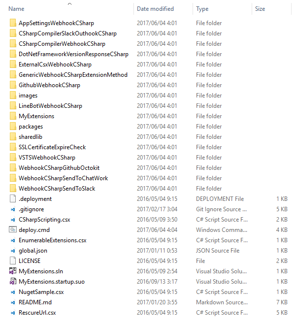

# More Reference

http://tech.guitarrapc.com/archive/category/AzureFunctions

# Precompiled functions reference

Refer basic information with https://github.com/Azure/azure-webjobs-sdk-script/wiki/Precompiled-functions .

Following additional tips will be useful for first step.

Description | Screenshot
---- | ----
You can use both VS2015 Update3 and VS2017. Make sure install [Azure Functions Core Tools](https://www.npmjs.com/package/azure-functions-core-tools) | 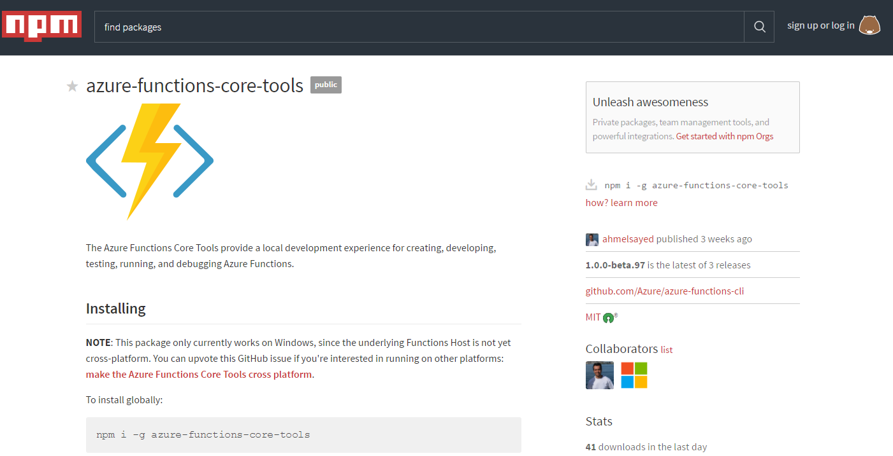
Use precompile function when you want to gain more faster execution and IDE compile, debug benefits. <br/>Unfortunately `.csx` is not yet match friendly for VS Debugging. It will not detect compile error and less intellisense at all.<br/> Therefore you will find .csx will cause compile error on Function App portal so often.<br/> If you feel it reduse your efficiency, then use precompile instead. This repo and [doc](https://blogs.msdn.microsoft.com/appserviceteam/2017/03/16/publishing-a-net-class-library-as-a-function-app/) and [doc for vs2017](https://blogs.msdn.microsoft.com/webdev/2017/05/10/azure-function-tools-for-visual-studio-2017/) offer you how.| 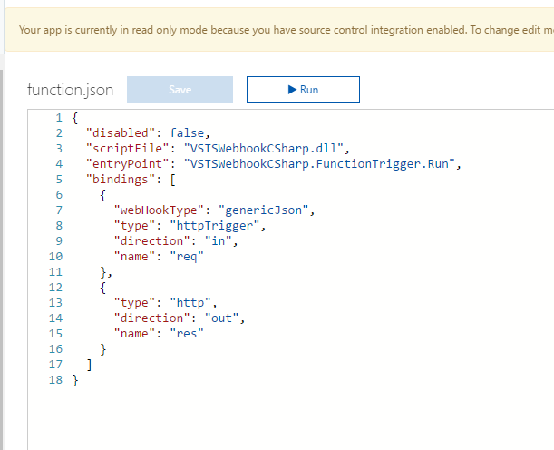
Precomplied function's Entry point will accept TraceWriter. Use Logger as same as .csx even you are using Precompile. You need to add [Microsoft.Azure.WebJobs.Host](https://www.nuget.org/packages/Microsoft.Azure.WebJobs) nuget package to refer TraceWriter. <br/> If you are using TraceWriter, add the NuGet package Microsoft.Azure.WebJobs and the statement: using Microsoft.Azure.WebJobs.Host| 
Precompiled function's Entry point will accept various Triggers. <br/>If you using timer triggers, add the NuGet package Microsoft.Azure.WebJobs.Extensions. | 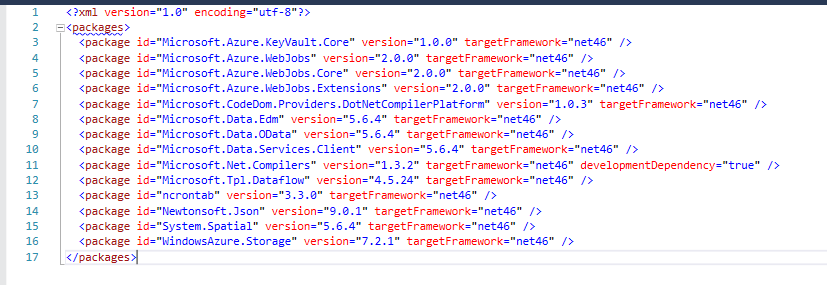
Precompiled function required to add [Microsoft.AspNet.WebApi.Core](https://www.nuget.org/packages/microsoft.aspnet.webapi.core/) nuget package for several HttpRequestMessage Extensions. | 
Precompiled function's dll will be locked by w3wp.exe when deployed function. This behaiviour is fixed but need to deploy into DEPLOYMENT_TEMP beforehand. <br/> See sampple deploy in deploy.cmd | 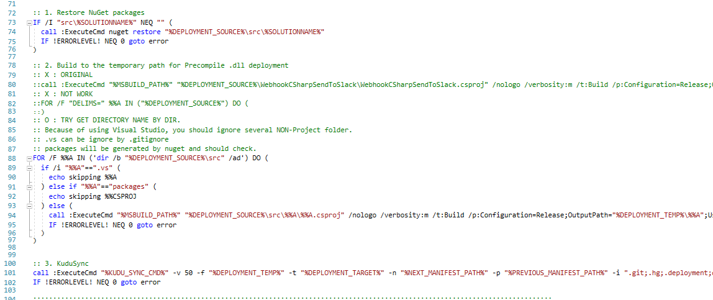
Take care about nuget restore and KUDU SYNC volume. Dynamic pricing is limited to 1GB and will easily reach to the size with precompile.<br/>This repogitory needs 288MB for full Nuget package restore, it means total 500MB when build. <br/>Then Deploy will COPY to DEPLOYMENT_TEMP for Shadowcopy then COPY to production location. <br/>OK. you know what happens. I Recopment split codes for usage (Trigger, timer or other) or use Service Plan model. | 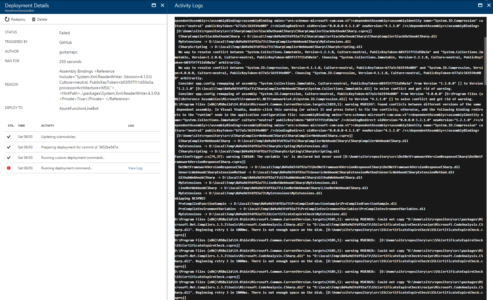

# Recommend Azure Functions settings for stability and efficiency

These settings are my recommendation with using AzureFunctions.

Description | Screenshot
---- | ----
[Concider to select Dynamic Service Plan if possible.]((https://azure.microsoft.com/en-us/documentation/articles/functions-scale/)) <br/>This will bring you best cost efficiency and scalability. | 
Keep your Azure Functions Runtime version up-to-date. Actually there's no meaning concider downtime because apply will be done in just a seconds. | <br/>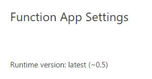
[Keep Function App Platform 32bit (don't change to 64bit)](http://stackoverflow.com/questions/36653122/is-there-any-difference-between-platform-32-bit-or-platform-64-bit-for-azure) | 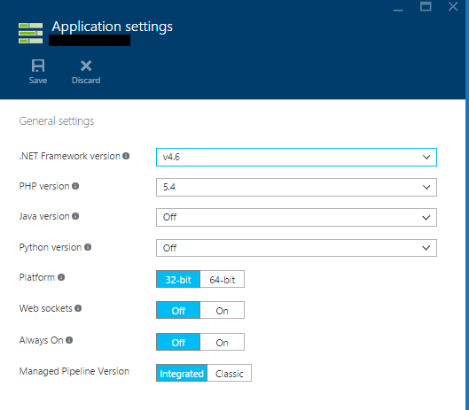
Do not run out memory, add Dynamic Memory if needed! Default 128MB will be run out easiry. Upgrade to 256MB or higher as your app requires.<br/> Dynamic Plan pricing is relates to Memory size, but less meanful to concider.<br/>[AzureFunctions pricing is here.](https://azure.microsoft.com/en-us/pricing/details/functions/)  | 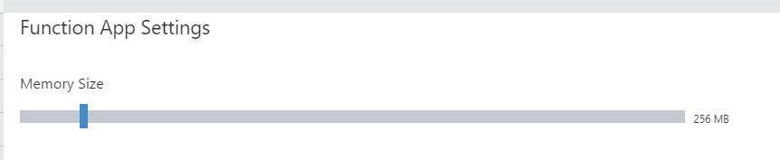
Make sure your functions memory comsumptions will be less than 1536MB. [This is limiation of Dynamic Service Plan](https://azure.microsoft.com/en-us/documentation/articles/functions-scale/). <br/>In case you exceed 1536MB there's 2 options.<br/> - Divide to separate functions. <br/>- Combine all functions to single App Service Plan. | 
Stop nesting multiple Azure Functions, use ```#load "<YourCoolLogic.csx>"```, or project reference for Precompile class library, to load shared code. <br/> This is efficient and speedier way to call functions.  |  <br/> 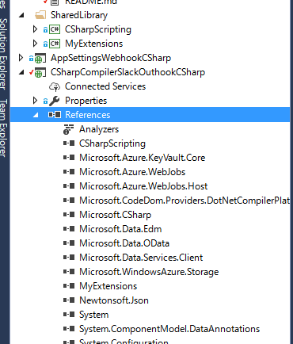
Use AppSettings to store secret values. This eliminate sensitive value in the source code.<br/>You can load it with both ```System.Environment.GetEnvironmentVariable("Key")``` or ```System.Configuration.ConfigurationManager.AppSettings["Key"]```. <br/> C# sample with screenShot: ```GetEnvironmentVariable("Secret_Value")``` or ```ConfigurationManager.AppSettings["Secret_Value"];```<br/>[See C# Dev Samples for more details](https://azure.microsoft.com/en-us/documentation/articles/functions-reference-csharp/) |  

# Not Recommend

There's are possible but I never recommend. These settings will bring complexity.

Description | Screenshot
---- | ----
Default TimeZone is UTC, but you can use LocalTime zone with ```WEBSITE_TIME_ZONE``` into Application Settings.<br/>You can obtain all timezone string with ```System.TimeZoneInfo.GetSystemTimeZones()``` <br/>Detail is here : [Changing the server time zone on Azure Web Apps](https://blogs.msdn.microsoft.com/tomholl/2015/04/06/changing-the-server-time-zone-on-azure-web-apps/)  | 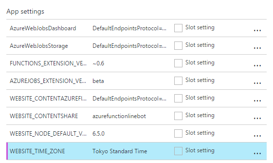
To keep Deployment simplicity, I do recommend not to mix Precompile functions and .csx functions. | 

# License

[MIT](https://github.com/guitarrapc/AzureFunctionsIntroduction/blob/master/LICENSE)
