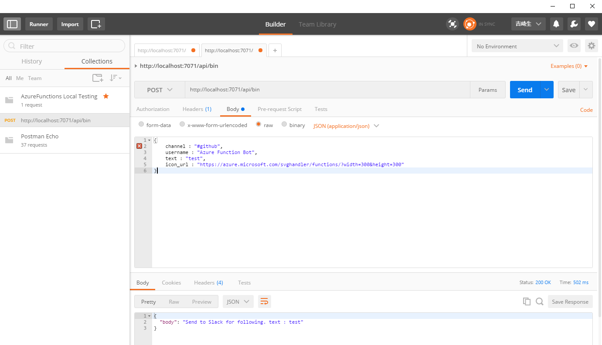
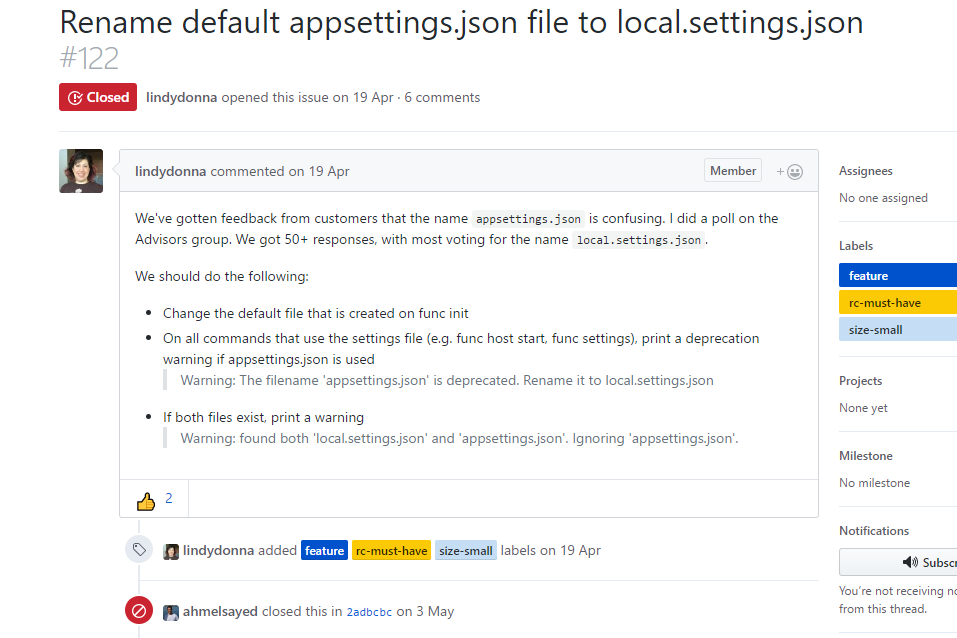
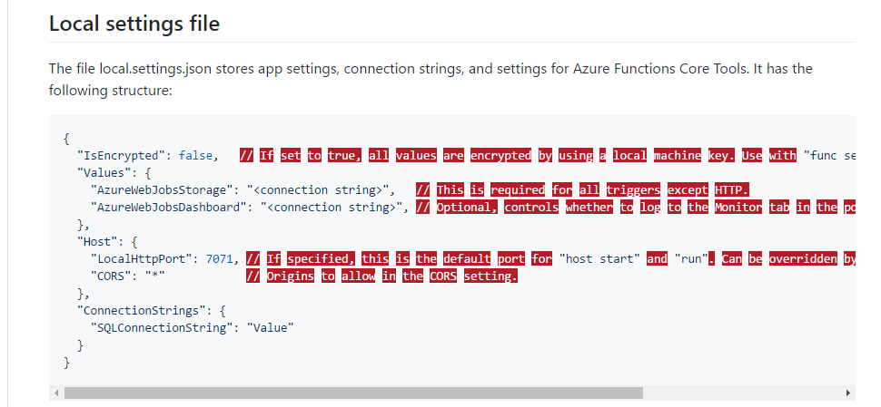
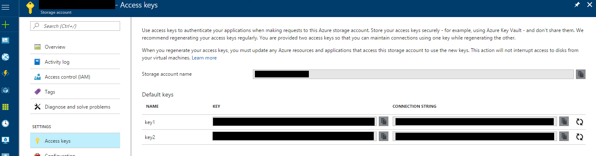
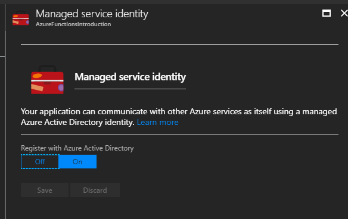
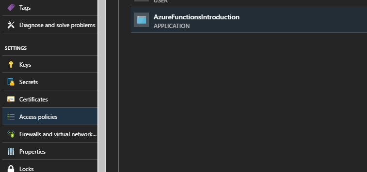

# AzureFunctionsIntroduction

This is Sample project for Azure Functions. May this repository help you understand Azure Functions better.

I strongly recommend you to use v2 samples. v1 and csx are limited and obsolated.

# What you can know

Please refer v2/.

# More Reference

Reference | Description
---- | ----
[Blog post - tech.guitarrapc.com](http://tech.guitarrapc.com/archive/category/AzureFunctions) | Blog post for AzureFuncitons by repository owner.
[Azure/Azure-Functions](https://github.com/Azure/Azure-Functions) | AzureFunctions official repo. You may find where to report Issue, Feature Requests, Questions and Help.
[Microsoft Azure WebJobs SDK Quick Reference](https://jhaleyfiles2016.blob.core.windows.net/public/Azure%20WebJobs%20SDK%20Cheat%20Sheet%202014.pdf) | Web Job SDK cheat sheet.

## Clone Remove AppSettings to the local

```
func azure functionapp fetch-app-settings AzureFunctionsIntroductions
Remove-Item ./local.settings.json -Force
Rename-Item ./appsettings.json local.settings.json -Force
```

# Precompiled functions reference

Refer many samples and demo.

> https://github.com/Azure/Azure-Functions/wiki/Samples-and-content

Following additional tips will be useful for first step.

Description | Screenshot
---- | ----
VS2017 Update3 and higher is required for v2. | 
Use v2 precompile function when you want to gain more faster execution and IDE compile, debug benefits.  |
Unfortunately `.csx` is not yet match friendly for VS Debugging. It will not detect compile error and less intellisense at all.<br/> Therefore you will find .csx will cause compile error on Function App portal so often. If you feel it reduce your efficiency, then use precompile instead. |
There are several way for local debug with post/get request, LinqPad, PowerShell, curl and others. I use [PostMan](https://www.getpostman.com/) Chrome extensions heavily when local debugging and remote debugging. | 

# Recommend Azure Functions settings for stability and efficiency

These settings are my recommendation with using AzureFunctions.

Description | Screenshot
---- | ----
[Concider to select Dynamic Service Plan if possible.]((https://azure.microsoft.com/en-us/documentation/articles/functions-scale/)) <br/>This will bring you best cost efficiency and scalability. | 
Keep your Azure Functions Runtime version up-to-date. Actually there's no meaning concider downtime because apply will be done in just a seconds. | <br/>
[Keep Function App Platform 32bit (don't change to 64bit)](http://stackoverflow.com/questions/36653122/is-there-any-difference-between-platform-32-bit-or-platform-64-bit-for-azure) | 
Do not run out memory, add Dynamic Memory if needed! Default 128MB will be run out easiry. Upgrade to 256MB or higher as your app requires.<br/> Dynamic Plan pricing is relates to Memory size, but less meanful to concider.<br/>[AzureFunctions pricing is here.](https://azure.microsoft.com/en-us/pricing/details/functions/)  | 
Make sure your functions memory comsumptions will be less than 1536MB. [This is limiation of Dynamic Service Plan](https://azure.microsoft.com/en-us/documentation/articles/functions-scale/). <br/>In case you exceed 1536MB there's 2 options.<br/> - Divide to separate functions. <br/>- Combine all functions to single App Service Plan. | 
Use AppSettings to store secret values. This eliminate sensitive value in the source code.<br/>You can load it with both ```System.Environment.GetEnvironmentVariable("Key")``` or ```System.Configuration.ConfigurationManager.AppSettings["Key"]```. <br/> C# sample with screenShot: ```GetEnvironmentVariable("Secret_Value")``` or ```ConfigurationManager.AppSettings["Secret_Value"];```<br/>[See C# Dev Samples for more details](https://azure.microsoft.com/en-us/documentation/articles/functions-reference-csharp/) |  
`appsettings.json` is [deprecated](https://github.com/Azure/azure-functions-cli/issues/122), use `local.settings.json` instead. | 
Fetch AppSettings on Remote Azure to local dev | install `npm i -g azure-functions-cli`, login `func azure login`, select subscription `func azure subscriptions list`, list functionapp ``func azure functionapp list`, then fetch to local `func azure functionapp fetch-app-settings AzureFunctionsIntroduction`. rename to local.settings.json and now all variables are fetched to local as like remote.
Use ConfigurationManager if possible. | ConfigurationManager is rather better for above fetch approatch, it can dectypt fetched encrypt data. [ConfigurationManagerHelper](https://github.com/guitarrapc/AzureFunctionsIntroduction/blob/master/v2/src/AzureFunctionsIntroduction/StaticHelpers/ConfigurationManagerHelper.cs) will improve ConfigurationManager mutch friendly.
[Set AzureWebJobsStorage for Timer Triggers or others.](https://github.com/Microsoft/azure-docs/blob/master/articles/azure-functions/functions-run-local.md) |  <br/> 
Enable [Managed Service Identity](https://docs.microsoft.com/en-us/azure/app-service/app-service-managed-service-identity#creating-an-app-with-an-identity) when using KeyVault or access to other azure resource. Then add AccessPolicy of KeyVault. But still cannot debug from local. Use Remote Debug. |  

# Not Recommend

There's are possible but I never recommend. These settings will bring complexity.

Description | Screenshot
---- | ----
Don't use v1 from now. v2 is far more recommended. | 
Default TimeZone is UTC, but you can use LocalTime zone with ```WEBSITE_TIME_ZONE``` into Application Settings.<br/>You can obtain all timezone string with ```System.TimeZoneInfo.GetSystemTimeZones()``` <br/>Detail is here : [Changing the server time zone on Azure Web Apps](https://blogs.msdn.microsoft.com/tomholl/2015/04/06/changing-the-server-time-zone-on-azure-web-apps/)  | 
To keep Deployment simplicity, I never recommend mix up Precompile functions and .csx functions. | 

# License

[MIT](https://github.com/guitarrapc/AzureFunctionsIntroduction/blob/master/LICENSE)
